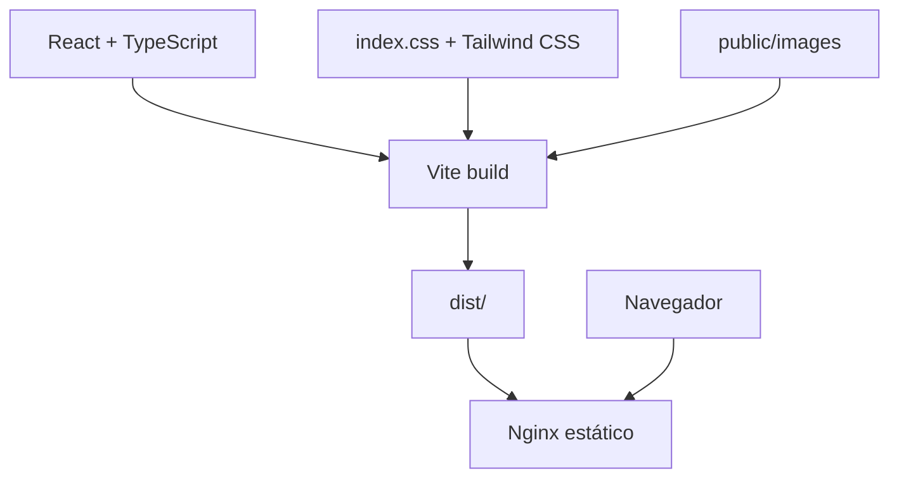

# Technical Architecture Record

## Contexto y objetivos
Se necesita una landing de una sola página, rápida, estática, duplicable y segura para una demostración ficticia.

## Arquitectura final
React renderiza `App` en el navegador. Vite compila TypeScript, Tailwind procesa estilos y `public/images` entrega fotografías locales. Nginx sirve `dist/`; no existe backend.

## Organización
`App.tsx` agrupa la composición por secciones y componentes reutilizables para Header, Footer, FAB y `DemoNotice`. El contenido repetido de navegación, tratamientos, beneficios y testimonios usa constantes locales.

## Build y despliegue
`pnpm install --frozen-lockfile`, `pnpm run typecheck`, `pnpm run build`; Nginx publica `dist/`. No requiere SPA fallback porque la experiencia usa una sola ruta.

## Imágenes
Se sirven seis JPEG locales, con `aspect-ratio`, `loading="lazy"` fuera del hero y `loading="eager"` para el hero.

## Accesibilidad y rendimiento
HTML semántico, skip link, un `h1`, labels, foco visible, menú móvil con estado ARIA, modal con Escape y restauración de foco, `aria-live`, alt text y `prefers-reduced-motion`. La fuente se carga desde Google Fonts; para una auditoría offline futura puede auto-hospedarse.

## Privacidad y seguridad
No hay fetch, analítica, storage, cookies ni datos reales. Metadata incluye `noindex, nofollow`. El formulario es local y se reinicia tras la confirmación.

## Riesgos y limitaciones
La calidad final de fuentes depende de red en el primer render. No hay automatización de navegador configurada. Las fotos son ilustrativas y deben revisarse legalmente antes de reutilizarse en otro cliente.

## Evoluciones
Extraer contenido a `src/content`, añadir pruebas de navegador y auto-hospedar fuentes solo si el número de landing pages lo justifica.
